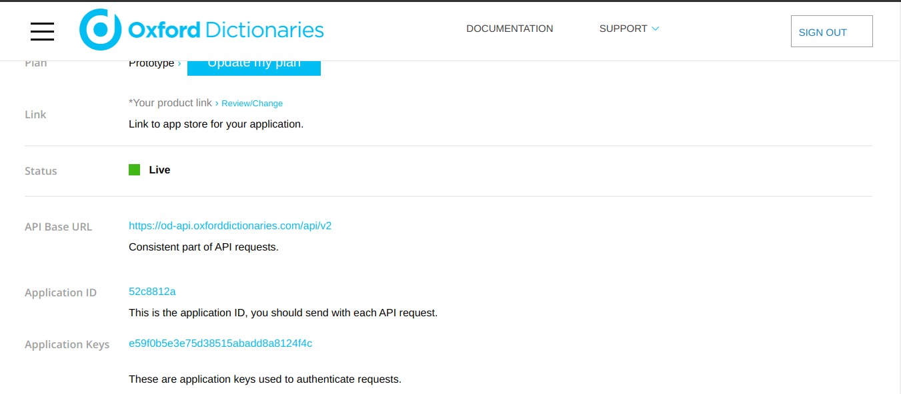
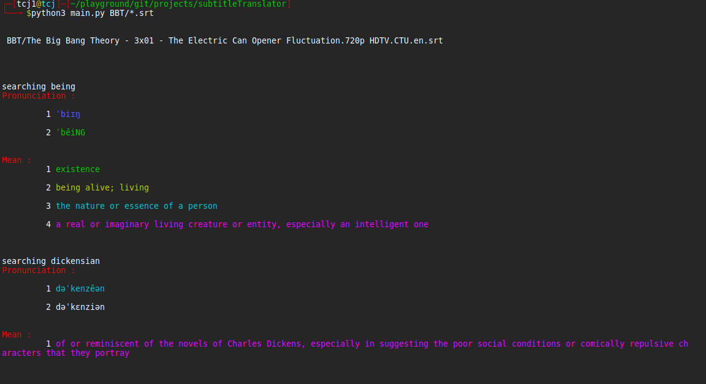

# Intro
- This is a cross platform subtitle words definer. It'll give you meaning of words used in english subtitle from oxford dictionarie.


## How to run
- Goto oxford website and signup and request for api.
- Free API are limite to 1000 requests per month so signup with [multiple accounts](https://fakemail.net) and add api to conf file



- put app id and app keys in conf.py file's dictionary
- That's it all. Run file now


```
$ pip3 install -r requirements.txt
$ python3 main.py [file|files]
```
## For example 

```
$ python3 main.py big\ bang\ theory\ S01E01.srt # for linux
$ python3 main.py big/ bang/ theory/ S01E01.srt # for windows
```

### Output 



- If you don't provide any files explicitly it'll select all the subtitle files(srt, vtt) and will show the results on terminal 


## Note :- 

- You must have python3 for running the script
- Subtitle file_path should be absolute (C:/users/*/movie.srt)


## TODO's

- Apply Machine Learning to know what words user doesn't know
- recognize type of words(adjective/ noun/ verb.) and provide relevant result
- recognize proverbs, idioms, phrasel verbs etc
- Add support of other dictionaries 
